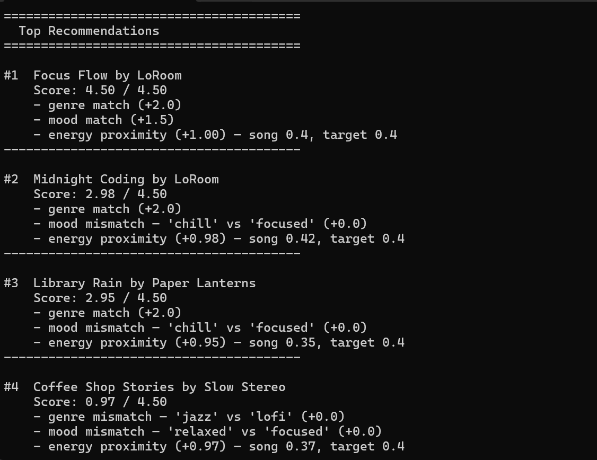
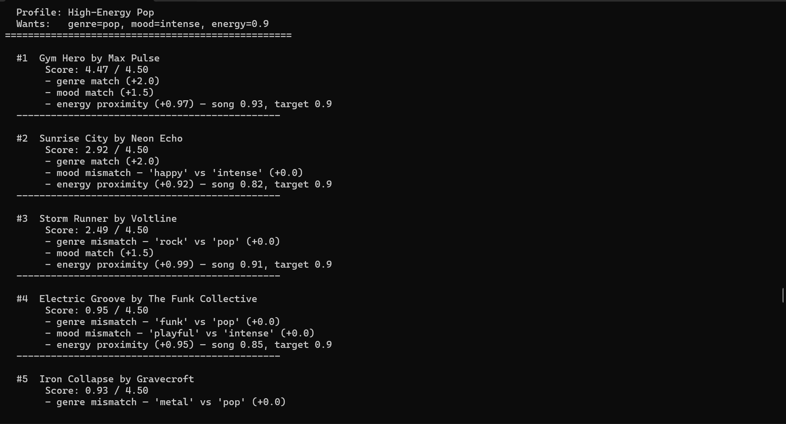
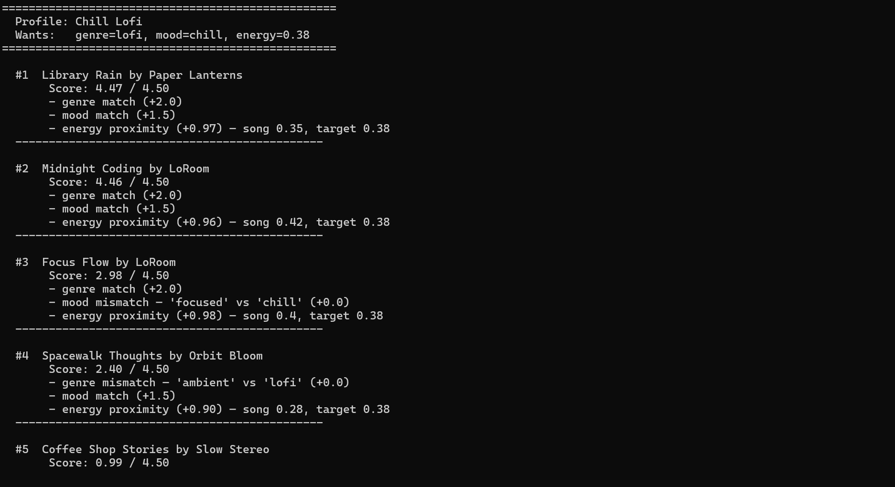
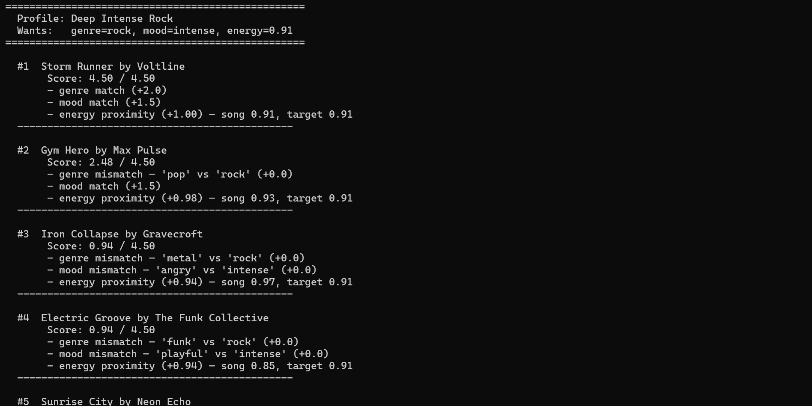
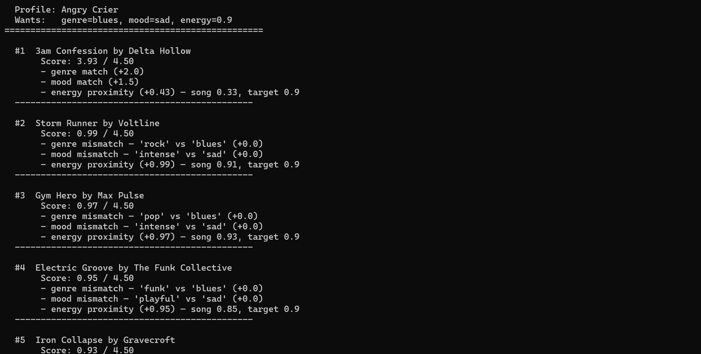
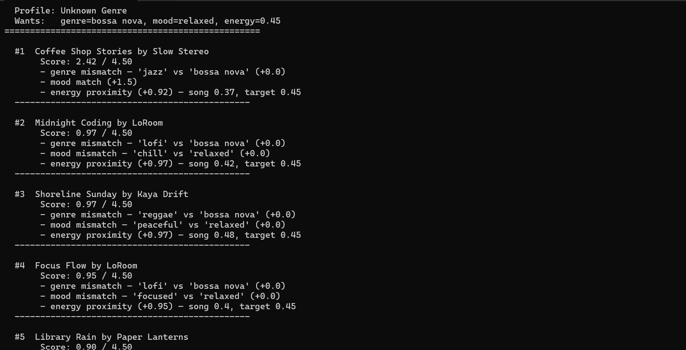
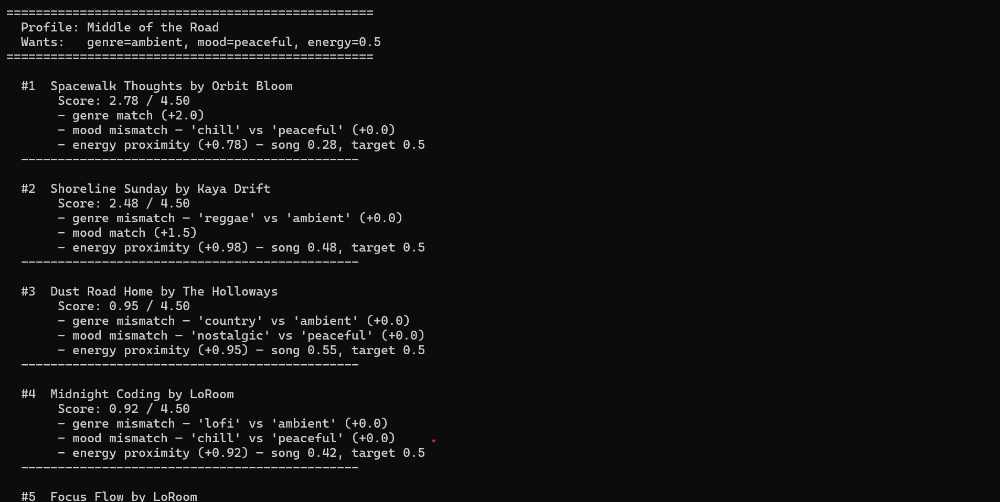

# 🎵 Music Recommender Simulation

## Project Summary

In this project you will build and explain a small music recommender system.

Your goal is to:

- Represent songs and a user "taste profile" as data
- Design a scoring rule that turns that data into recommendations
- Evaluate what your system gets right and wrong
- Reflect on how this mirrors real world AI recommenders

This version scores each song in an 18-song catalog against a user's preferred genre, mood, and energy level using a weighted formula. It returns the top 5 matches and was evaluated across six user profiles — including three adversarial edge cases — to find where the scoring logic breaks down.

---

## How The System Works

Real recommendation systems predict what you will like next by matching behavioral datasets with machine learning models that detect patterns in what you, and millions of others, consume. Real‑world recommenders like Spotify and YouTube use two kinds of data: features of the item (such as genre, mood, tempo, or video topic) and features of the user (their watch/listen history, skips, likes, and search behavior). The system first builds a representation of each item from its content features, then builds a representation of the user’s preferences based on the patterns in their past behavior. These inputs feed into a ranking model that scores every possible item and selects the ones the user is most likely to enjoy next. This separates the raw input data (item features and user history) from the learned preference profile (what the model thinks the user likes) and from the final ranking step (choosing which items to show). Two foundational approaches are collaborative-based filtering and content-based filtering, and many real platforms use a hybrid of both. 

### Song Features

Each `Song` is loaded from `data/songs.csv`. Our model uses three features:

- **genre** — categorical label (e.g. `lofi`, `pop`, `rock`, `ambient`)
- **mood** — categorical label (e.g. `chill`, `intense`, `happy`, `focused`)
- **energy** — how intense or active the song feels (0 = very calm, 1 = very intense)

---

### UserProfile

A `UserProfile` stores the user's target preferences as a single snapshot:

- `favorite_genre` — their preferred genre category
- `favorite_mood` — their preferred mood category
- `target_energy` — the energy level they want right now (0–1)

---

### Scoring a Song

For each song, the `Recommender` computes a **total score** as a weighted sum of partial scores:

```
total_score =
  2.0 × genre_match       (1.0 if genre matches, else 0.0)
  1.5 × mood_match        (1.0 if mood matches, else 0.0)
  1.0 × energy_proximity  (1 − |song.energy − user.target_energy|)
```

**Proximity scoring** is used for energy. Rather than rewarding high or low values, it rewards songs whose energy is *closest to the user's target*. A perfect match scores 1.0; the furthest possible value scores 0.0. This prevents the system from always pushing toward extremes (e.g. always recommending the highest-energy songs to someone who wants moderate energy).

---

### Choosing Recommendations

After scoring every song, the `Recommender`:

1. Sorts all songs by `total_score` in descending order
2. Returns the top `k` songs (default `k = 5`)

```
User Profile
    │
    ▼
Score every song  ──►  sort by score  ──►  return top k
```

Genre and mood carry the most weight because they represent the broadest musical identity. Energy refines the ranking within that category.

---

## Getting Started

### Setup

1. Create a virtual environment (optional but recommended):

   ```bash
   python -m venv .venv
   source .venv/bin/activate      # Mac or Linux
   .venv\Scripts\activate         # Windows

2. Install dependencies

```bash
pip install -r requirements.txt
```

3. Run the app:

```bash
python -m src.main
```

### Running Tests

Run the starter tests with:

```bash
pytest
```

You can add more tests in `tests/test_recommender.py`.

---

## Experiments You Tried

- **Halved genre weight (2.0 → 1.0), doubled energy weight (1.0 → 2.0):** Storm Runner (rock) jumped to #2 for a High-Energy Pop user. A strong energy match was enough to nearly override the genre mismatch.
- **Tested a "Middle of the Road" profile (ambient/peaceful/energy=0.5):** Songs from completely unrelated genres clustered within 0.04 of each other in score, making the ranking feel arbitrary.
- **Tested an "Unknown Genre" profile (bossa nova):** Genre contributed zero points to every song with no warning. The system fell back to mood and energy only as a result.
- **Tested the "Angry Crier" profile (blues/sad/energy=0.9):** The only matching song had energy=0.33, yet still ranked #1. Doubling the energy weight caused high-energy rock and pop songs with no genre match to close in on the score.

---

## Demo


## Tests

### Regular Profiles:




### Edge-case Profiles:




## Limitations and Risks

- Only works on a catalog of 18 songs. Niche or global genres are missing entirely.
- Missing genres cause silent failures: the system keeps scoring confidently even when no genre match exists.
- Moods like `chill`, `relaxed`, and `peaceful` are treated as completely different labels even though they sound similar to a human listener.
- Users with moderate energy targets (~0.5) get artificially close scores across unrelated genres, making rankings feel arbitrary.

See the model card for a full breakdown.

---

## Reflection

Read and complete `model_card.md`:

[**Model Card**](model_card.md)

Recommenders don't understand music, they just match labels and weights. Building this system made it clear that the quality of recommendations depends entirely on two things: how well the catalog covers a user's actual taste, and how well the weights reflect what users actually care about most. 

The fairness issue that stood out most was catalog coverage. Users whose preferences happened to match the catalog got strong, useful results. Users with niche or underrepresented tastes got poor results with no explanation. This same pattern shows up in real apps as well. Systems trained on popular music will serve mainstream users well and underserve everyone else. The bias isn't in the algorithm itself but rather the data it relies on.

The biggest learning moment for me occurred while I was conducting the experiments. The limitation of the energy metric because of the way I chose to calculate it and score the songs taught me just how important design choices are when it comes to outcomes, and how in the real world you will always have to balance tradeoffs when designing systems.

AI primarily helped with providing design changes and implementing the functions for the model. I needed to double check the AI when making any major changes to the code.

Simple algorithms can still feel like recommendations because human preference is very structured and patterned, so it's easy to fall into the illusion that it this algorithm is a personalized advisor.

The next thing I would try would be to update the algorithm to take multiple preferred moods or genres so users with mixed tastes aren't penalized.

---

